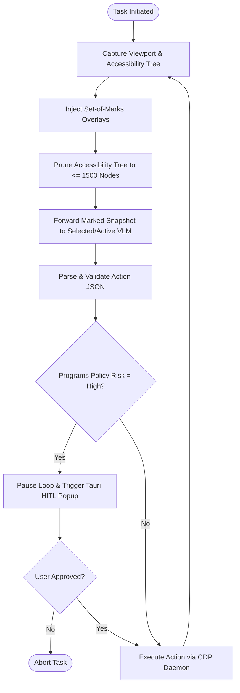

# CHAPTER THREE: SYSTEM DESIGN AND METHODOLOGY

## 3.0 INTRODUCTION

The literature reviewed in the preceding chapter established a clear intellectual foundation: the convergence of Transformer-based vision-language models, low-level browser automation protocols, and local-first execution paradigms has made autonomous web agency a tractable engineering problem. What the literature does not provide, however, is a concrete, end-to-end system design that integrates these components into a working, secure, and evaluable artefact. The gap between theoretical capability and operational reality is vast. A VLM that can reason about a screenshot in a controlled research notebook is not the same thing as a daemon process that must reliably parse that screenshot, issue a structured action command, validate it against programmatic safety rules, dispatch it through a WebSocket to a live Chrome instance, and repeat the cycle dozens of times without state corruption, credential leakage, or prompt injection compromise. This chapter closes that gap by presenting the complete system design, algorithmic methodology, and evaluation framework engineered for the system.

Designing a production-viable autonomous web agent demands that architectural decisions be made across every layer of the software stack simultaneously, because the constraints at each layer propagate upward and downward in ways that are not separable. At the top of the stack, the presentation layer must render a responsive desktop interface that streams real-time execution state to the user without ever gaining direct access to the operating system filesystem or the browser's credential store — a constraint that rules out Electron in favour of Tauri's Rust-compiled shell with capability-scoped allowlists. In the middle, the orchestration layer must host a stateful reasoning loop that coordinates vision capture, prompt assembly, VLM inference, JSON parsing, schema validation, risk re-classification, and CDP command dispatch, all while maintaining asynchronous streaming channels to the desktop frontend over local loopback HTTP and Server-Sent Events. At the bottom, the actuation layer must bypass the fragile abstractions of Selenium and Playwright entirely, communicating instead through raw Chrome DevTools Protocol WebSocket frames that give deterministic control over mouse position, keystroke injection, viewport capture, and accessibility tree extraction. The polyglot nature of this stack — Rust for the desktop shell, TypeScript and React for the dashboard, Python 3.12 and FastAPI for the reasoning daemon — is not an aesthetic choice; it is a direct consequence of each language occupying the point in the design space where its runtime guarantees, library ecosystem, and concurrency model are optimally matched to the tier's requirements.

The observe-decide-act loop that sits at the computational centre of the system is deceptively simple in its conceptual outline and extraordinarily demanding in its implementation. At each discrete time step, the system must capture a high-resolution viewport screenshot, extract and prune the browser's accessibility tree to keep token counts within model context limits, overlay numbered Set-of-Marks visual labels onto interactive elements to discretise an otherwise continuous coordinate prediction space, assemble a multimodal prompt combining the marked image with the structured tree and conversation history, stream that prompt to whichever VLM provider is currently active, parse the returned JSON action block through a rigid Pydantic v2 schema boundary that rejects any field not explicitly whitelisted, reclassify the action's risk level using deterministic server-side policy rules that cannot be overridden by prompt-injected model outputs, gate high-risk actions behind a native Tauri confirmation popup that physically blocks the CDP command from reaching the browser until the user approves it, and — only after all these checks have passed — convert the validated action into a low-level CDP command and dispatch it. Every one of these steps carries a failure mode that must be handled gracefully: malformed JSON triggers a schema repair loop rather than a crash; a provider returning HTTP 429 initiates a cancel-safe exponential backoff with automatic fallback to the next provider in the queue; a navigation to an external domain triggers an immediate loop abort regardless of what the VLM reported.

The evaluation methodology proposed in this chapter is designed to test the system's central hypothesis directly: that vision-grounded agency, when paired with deterministic safety gates and local execution, achieves superior robustness to frontend churn compared to traditional DOM-scripted automation. Rather than benchmarking against static, curated datasets in isolation, the proposed evaluation constructs a comparative framework in which the system's visual execution loop and a set of Playwright/Selenium baseline scripts are subjected to both clean and deliberately obfuscated versions of real-world legacy web portals. The mathematical metrics — Task Success Rate, Visual Grounding Precision, and Structural Resilience Score — are formulated to quantify not merely whether a task completed, but whether the system's performance degraded gracefully or collapsed entirely when the underlying DOM structure was mutated. This is the empirical standard against which the architectural claims of the system design must ultimately be judged.

What follows is the full technical specification of the system: its multi-tier runtime topology, its polyglot monorepo code architecture, its stateful algorithmic execution loop expressed in both flowchart and pseudocode form, its observation preprocessing equations and data constraints, its model abstraction interface and provider fallback engine, its programmatic risk classification policy rules, its relational database schema with Row-Level Security constraints, and its proposed benchmarking methodology. Every design decision is documented with the rationale that produced it, and every algorithmic step is specified with the precision necessary for independent replication.

---

## 3.1 High-Level System Architecture

Mayra is designed around a decoupled, local-first hybrid architecture to ensure user privacy, low execution latency, and complete independence from Manifest V3 runtime constraints. The core architecture is modeled directly on the design criteria established in the system's official design blueprints: the **Product Requirement Document** ([MAYRA_PRD.md](file:///c:/Users/user/mayra/docs/MAYRA_PRD.md)) and the **Technical Implementation Specification** ([MAYRA_TECHNICAL_SPEC.md](file:///c:/Users/user/mayra/docs/MAYRA_TECHNICAL_SPEC.md)). 

The high-level architecture is organized as a decoupled, multi-tier runtime split into four distinct layers operating concurrently on the client’s local device, illustrated in Figure 3.1.

```
+---------------------------------------------------------------------------------+
|  FIGURE 3.1: Mayra local decoupled runtime architecture                          |
|                                                                                 |
|  [ Tauri Desktop App (Rust/JS) ] <==== (SSE / HTTP) ====> [ Python sidecar ]    |
|         |                                                            |          |
|  (Publishable Key)                                              (Secret Key)    |
|         |                                                            |          |
|         v                                                            v          |
|  [ Supabase Cloud (TSR Metrics) ]                          [ agent-browser ]    |
|                                                                      |          |
|                                                                    (CDP)        |
|                                                                      v          |
|                                                            [ User Chrome Profile] |
+---------------------------------------------------------------------------------+
```
*Figure 3.1: Detailed polyglot client-daemon runtime and cloud persistence sync topology.*

> [!TIP]
> **Academic Image Generator Prompt (Figure 3.1 Topology):**
> `"A professional, minimalist 2D block diagram representing a polyglot client-daemon software architecture, in the clean and simple visual style of an IEEE or ACM academic report. On a pure solid white background, flat vector shapes (rounded rectangles) represent system components with thin black outlines. The diagram consists of: 1. 'Presentation Tier (Tauri + React/Next.js)' in the top-left; 2. 'Orchestration Tier (FastAPI/Python Sidecar)' in the top-right; 3. 'Actuation Tier (agent-browser/CDP)' in the bottom-right; 4. 'User Chrome Profile' below it; 5. 'Cloud Persistence (Supabase)' in the bottom-left. Clean, thin black directional arrows connect components with sharp, highly legible labels in Helvetica font: a double-headed arrow labeled 'HTTP & SSE loopback' connects Tauri and FastAPI; a single arrow labeled 'IPC / Local Path' connects FastAPI to agent-browser; a single arrow labeled 'CDP WebSockets' connects agent-browser to User Chrome Profile; two arrows labeled 'Secure REST & RLS Sync' connect Tauri and FastAPI to Supabase. No 3D shadows, no gradients, no photorealistic elements, completely flat and neat design, slate gray and subtle blue color accents."`

### 3.1.1 The Polyglot Client-Daemon Paradigm & Repository Code Architecture
To maintain absolute separation of concerns, rapid builds, and a high-performance execution flow, Mayra is structured as a **Polyglot Monorepo**. This codebase architecture maps JS/TS frontend services, native Rust system shells, and an asynchronous Python sidecar into a unified repository layout. 

The canonical directory layout and directory structure—designed to enforce secure borders and prevent developer code drift—is structured as follows:

```text
mayra/
  package.json                 # Root monorepo configuration & JS/TS scripts
  pnpm-workspace.yaml          # PNPM workspaces configuration
  turbo.json                   # Turborepo JS/TS compiler pipelines
  pyproject.toml               # Python UV workspace root
  rust-toolchain.toml          # Pinned stable Rust toolchain
  README.md                    # Project landing documentation
  apps/
    web/                       # Presentation Tier: Next.js static export
      package.json
      next.config.ts
      src/                     # React components, UI state & dashboard views
    desktop/                   # Tauri desktop wrapper shell (Rust)
      package.json
      src-tauri/
        tauri.conf.json        # Tauri capability allowlists & desktop security scope
        src/
          main.rs              # Tauri bootstrap & Rust window setup
          sidecar.rs           # Python sidecar subprocess management commands
    orchestrator/              # Orchestration Tier: Python FastAPI service daemon
      pyproject.toml           # UV workspace member specification
      mayra_orchestrator/
        __main__.py            # Sidecar launch entry
        main.py                # FastAPI ASGI endpoints & lifecycle management
        agent_loop.py          # Stateful observe-decide-act reasoning loop
        risk.py                # Deterministic Python policy risk re-classifiers
        parser.py              # VLM output JSON string parser
        redaction.py           # Recursive privacy data scrubber
        actions/
          schema.py            # Generated Pydantic Action models
          mapper.py            # abstract actions to CDP commands mapper
        prompts/
          templates.py         # Structured system & few-shot prompt assembly
        providers/
          base.py              # ModelClient interface protocol
          gemini.py            # Google Gemini native REST adapter
          openai_compat.py     # Groq & Cloudflare Worker AI compat adapters
          factory.py           # Rate limiting and semaphore managers
        browser/
          adapter.py           # Long-running agent-browser CLI subprocess adapter
  packages/
    contracts/                 # Shared data contracts (JSON Schema source of truth)
      schemas/                 # Pydantic & TS action/event/approval models source
      src/
        generated.ts           # Compiled TypeScript type assets
      python/
        mayra_contracts/       # Compiled Python contract schemas
      scripts/
        codegen.mjs            # Automates schema-to-TS and schema-to-Pydantic codegen
  supabase/
    migrations/                # PostgreSQL append-only relational audit schemas
```

### 3.1.2 Presentation Tier (Tauri + Next.js Static Export)
The UI layer is engineered for extreme client-side responsiveness and security. It utilizes Tauri's Rust-compiled shell to host the desktop viewport. The visual dashboard is built using React and Next.js, which is compiled down to a pure static export (`output: 'export'`) stored directly inside the desktop app's native binaries. Tauri loads these visual assets locally via its secure, read-only `asset://` protocol (scoped strictly to `$APPLOCALDATA/Mayra/screenshots/**`), guaranteeing that the frontend interface has no direct, un-sandboxed access to the operating system's filesystem.

### 3.1.3 Orchestration Tier (FastAPI/Python 3.12 Daemon)
The reasoning, planning, and security decision-making logic resides in the Python-based FastAPI background daemon. It operates as a local subprocess sidecar managed dynamically by Tauri's Rust thread. Communication is handled locally using HTTP REST and Server-Sent Events (SSE) loopback streams. This tier runs the main agent loop, manages the active browser connection session, coordinates real-time token streams, validates visual JSON action blocks via Pydantic boundaries, and acts as the gatekeeper for user safety approvals.

### 3.1.4 Actuation & Perception Tier (agent-browser / CDP)
Low-level browser automation is handled by a dedicated CLI tool, Vercel’s `agent-browser`, running on the local `PATH` as a daemon. Python's `AgentBrowserAdapter` (`browser/adapter.py`) invokes the tool locally, establishing a loopback WebSocket connection to a running Chrome instance over remote debugging port `9222`. This tier bypasses brittle standard selector scripts by communicating directly via Chrome DevTools Protocol (CDP) domains—snapping WebP screenshots for visual grounding and dispatching raw hardware mouse clicks, scrolls, and key presses directly to the active profile.

---

## 3.2 Research Methodology Phases

To systematically design, engineer, and validate the capabilities of Mayra, the research methodology is organized into four sequential, rigorous phases:

1.  **Phase 1: Local System Engineering & Daemon Interfacing:**
    This phase focuses on building the polyglot monorepo infrastructure. It involves compiling the Rust-based Tauri wrapper, configuring Next.js for static exports, establishing Server-Sent Events (SSE) channels for real-time inter-process communication with the Python sidecar daemon, and configuring loopback WebSocket triggers over CDP debugging port `9222`.
2.  **Phase 2: Algorithmic Perception, Preprocessing & Safety Filtering:**
    This phase develops the real-time observation algorithms. It includes writing the WebP image downsampling triggers, the programmatic Set-of-Marks (SoM) coordinates overlay rendering engine, the mathematical accessibility tree node pruner, and the deterministic Python-based policy risk re-classification filter.
3.  **Phase 3: Multi-Provider Integration and Failover Setup:**
    This phase establishes the VLM reasoning engine. It involves constructing the unified `ModelClient` base class, wrapping individual providers (Gemini, Groq, Cloudflare, OpenAI), wrapping async RPM-rate-limiters and execution semaphores, and writing the stateful sequential provider fallback queue.
4.  **Phase 4: Proposed Benchmark Design and Metric Formulation:**
    The final phase designs the planned validation harness. It curates a dynamic task suite targeting legacy regional administrative portals (such as the FUTA student portal), establishes static DOM-based Playwright baseline scripts, and mathematically formalizes the evaluation metrics (TSR, VGP, SRS) to prepare for live experimental benchmark runs.

---

## 3.3 System Flowchart and Loop State-Transitions

### 3.3.1 Stateful Agentic Observe-Decide-Act Flowchart
The complete system lifecycle—tracing a user's goal from initiation, through iterative perception steps, multi-provider VLM reasoning, risk re-classification filters, Tauri-based user confirmation gates, and physical CDP actuation—is illustrated in Figure 3.2.


*Figure 3.2: Complete Mayra autonomous execution and safety flowchart.*

> [!TIP]
> **Academic Image Generator Prompt (Figure 3.2 Flowchart):**
> `"A professional, minimalist engineering flowchart mapping a stateful observe-decide-act software loop, in the clean and simple visual style of a LaTeX scientific paper or computer science thesis. On a solid, pure white background, flat 2D geometric vector blocks with thin black borders represent system steps. Blocks consist of: a capsule labeled 'Task Initiated' flowing into a rectangle 'Capture Viewport & Accessibility Tree', flowing into 'Inject Set-of-Marks Labels', flowing into 'Prune Accessibility Tree to <= 1500 Nodes', flowing into 'Forward Marked Snapshot to Selected/Active VLM', flowing into 'Parse & Validate Action JSON', flowing into a diamond decision shape 'Programmatic Policy Risk = High?'. The 'No' path from the diamond flows straight to rectangle 'Execute Action via CDP Daemon', which loops back to the 'Capture Viewport' block. The 'Yes' path from the diamond flows to 'Trigger Tauri HITL Popup', flowing into another diamond decision shape 'User Approved?'. The 'No' path from the second diamond flows to capsule 'Abort Task'. The 'Yes' path flows to 'Execute Action via CDP Daemon'. Thin, dark gray connector lines with sharp arrowheads and clean labels ('Yes', 'No') connect all shapes using highly legible Helvetica font. Completely flat design, no gradients, no shadows, no colors except for a clean gray palette with a single blue or orange accent color for key decisions."`

### 3.3.2 Step-by-Step Algorithmic Loop Analysis
The core orchestration loop operates as a stateful, iterative state machine over consecutive execution steps $t \in [1, T]$, where $T$ represents the maximum step budget. The complete execution, perception, parsing, and safety interception loop is presented formally in Algorithm 3.1:

```
Algorithm 3.1: Mayra Orchestration & Safety Loop
Input: User Goal G, Allowed Domains D, Max Steps M
Output: Terminal Status S (success | failed | aborted)

1:  task_id <- GenerateUUID()
2:  allowed_domains <- D
3:  step <- 1
4:  session <- agent_browser.open(task_id, allowed_domains, headed=True)
5:
6:  while step <= M do:
7:      viewport_img, raw_tree <- session.capture_observation()
8:      marked_img <- InjectSetOfMarks(viewport_img, raw_tree)
9:      pruned_tree <- PruneAccessibilityTree(raw_tree, max_depth=12, max_nodes=1500)
10:     
11:     prompt <- AssembleEnrichedPrompt(G, marked_img, pruned_tree, chat_history)
12:     raw_response <- VLM.complete_streaming(prompt)
13:     chat_reply, proposed_action <- ParseAndValidate(raw_response)
14:     
15:     # Enforce Server-Side Programmatic Risk Classification
16:     calculated_risk <- ClassifyPolicyRisk(proposed_action, pruned_tree)
17:     effective_risk <- Max(proposed_action.risk, calculated_risk)
18:     
19:     if effective_risk == "High" then:
20:         EmitEvent("approval_required", proposed_action)
21:         user_approved <- AwaitUserConfirmationGate(proposed_action)
22:         if not user_approved then:
23:             session.close()
24:             return "aborted"
25:     
26:     # Convert Pydantic Action to low-level CDP execution command
27:     cdp_cmd <- to_agent_browser_command(proposed_action)
28:     execution_result <- session.execute(cdp_cmd)
29:     
30:     if execution_result.status == "error" then:
31:         return "failed"
32:     
33:     EmitStepLogToSupabase(task_id, step, proposed_action, execution_result)
34:     step <- step + 1
35:
36: return "success"
```

---

## 3.4 Observation Preprocessing & Real-Time Data Constraints

To interact with dynamic viewports, Mayra captures two real-time data inputs at each step $t$: the raw high-resolution viewport screenshot ($S_t$) and the browser's parsed accessibility tree ($A_t$). Because these raw inputs are highly verbose, they are processed locally before being transmitted to the VLM.

### 3.4.1 Real-Time Visual Preprocessing
Raw PNG screenshots captured from high-DPI viewports are extremely large. To minimize token bandwidth and reduce API latency, Mayra's orchestrator converts raw PNG arrays into compressed WebP formats via high-efficiency visual downsampling, reducing the file size by up to 85% while retaining legible text boundaries.

### 3.4.2 Set-of-Marks (SoM) Bounding Box Coordinate Placement Heuristics
To bypass spatial coordinate hallucinations, Mayra discretizes the continuous visual space. The orchestrator:
1.  Extracts the exact bounding box coordinates $[x_{\text{min}}, y_{\text{min}}, x_{\text{max}}, y_{\text{max}}]$ for every interactive control found in the accessibility tree.
2.  Programmatically draws semi-transparent, highly contrasting numbered overlays (e.g., `[12]`) directly over the targeted coordinates on the WebP viewport screenshot.
This generates the marked observation image $M_t = \text{SoM}(S_t, A_t)$. When the VLM processes the page, it does not need to guess coordinate dimensions; it simply selects the discrete target reference integer (e.g., `"12"`), which programmatically maps directly to the active element.

### 3.4.3 Structural Preprocessing (Accessibility Tree Parsing & Node Pruning Equations)
Raw HTML documents and DOM structures frequently exceed standard model context limits. To resolve this, Mayra extracts the browser's accessibility tree and runs it through a programmatic pruning function.
Let $\mathcal{N}$ represent the raw set of accessibility nodes on a page. We extract a pruned subset $\mathcal{N}_{\text{pruned}}$ defined as:

$$
\mathcal{N}_{\text{pruned}} = \{ n \in \mathcal{N} \mid \text{role}(n) \in \mathcal{R}_{\text{interactive}} \land \text{depth}(n) \le 12 \}
$$

where the set of interactive roles is defined as:

$$
\mathcal{R}_{\text{interactive}} = \{ \text{button}, \text{link}, \text{textbox}, \text{combobox}, \text{checkbox}, \text{radio}, \text{tab}, \text{heading}, \text{form} \}
$$

The total tree capacity is strictly capped at $|\mathcal{N}_{\text{pruned}}| \le 1500$ nodes. If the node limit is exceeded, the orchestrator narrows the tree's scope, extracting only the elements located within the active, visible viewport.

---

## 3.5 Proposed Model Schema & Validation Interface

### 3.5.1 The Pydantic v2 Action Schema
To prevent prompt injection payloads from triggering arbitrary server commands, Mayra enforces a rigid JSON contract at the API boundary using a Pydantic v2 validation schema. The VLM is instructed to output a structured JSON action block matching the schema:

$$
\text{Action} = \{ \text{action} \in \mathcal{A}, \text{target\_ref}: \text{str}, \text{value}: \text{str}, \text{risk}: \text{str}, \text{reason}: \text{str} \}
$$

where the set of allowed physical actions is strictly restricted to:

$$
\mathcal{A} = \{ \text{click}, \text{type}, \text{scroll}, \text{wait}, \text{navigate}, \text{done} \}
$$

The model class is compiled with `ConfigDict(extra='forbid', frozen=True, strict=True)`. Any unrecognized parameters or unauthorized commands are instantly blocked at the network interface by a `ValidationError`, insulating the local OS.

### 3.5.2 Automated Syntax Error and Schema Repair Loops
In the event that a VLM returns malformed JSON, a missing key, or a schema structure that fails the Pydantic boundary, the orchestrator intercepts the exception. Rather than terminating the workflow, it consumes a "repair step" from a dedicated repair budget. It compiles a specialized repair prompt containing the raw malformed output and the exact Pydantic validation error stack. The VLM is prompted to fix its output, executing a self-healing error recovery loop in the background.

---

## 3.6 Multi-Provider Model Selection & Abstraction

### 3.6.1 The Unified Model Abstraction Interface (ModelClient Base)
To prevent API vendor lock-in and enable seamless cross-model benchmarking, Mayra implements a custom **Adapter Pattern** at the orchestration layer. An abstract base class `ModelClient` (`providers/base.py`) defines a unified interface:

```python
class ModelClient:
    async def complete_streaming(
        self,
        prompt: PromptBundle,
        *,
        temperature: float,
        on_token: TokenCallback,
    ) -> str:
        """Stream model tokens and return the full content string."""
        raise NotImplementedError

    async def health_check(self) -> float:
        """Execute a lightweight GET request to check auth/health and return latency."""
        raise NotImplementedError
```

### 3.6.2 VLM Provider Configurations
By deriving concrete clients from this base, Mayra seamlessly integrates multiple API providers:
*   **Google Gemini (`providers/gemini.py`):** Uses the native `GeminiClient` to communicate directly with Google's beta REST endpoints, defaulting to `gemini-2.5-flash` for high-speed visual reasoning.
*   **Groq (`providers/openai_compat.py`):** Utilizes `create_groq_client` to target Llama-based vision models (defaulting to the highly optimized vision model `meta-llama/llama-4-scout-17b-16e-instruct`).
*   **Cloudflare Workers AI (`providers/openai_compat.py`):** Uses `create_cloudflare_client` to query hosted serverless weights (e.g. `@cf/meta/llama-3.1-8b-instruct`).
*   **OpenAI Compatibility Engines:** Utilizes the generic `OpenAICompatClient` to bridge to other OpenAI-compliant models (such as GPT-4o, O-series models, or xAI's Grok).

### 3.6.3 Dynamic Edge-Driven Key Decoupling and Bootstrapping Heuristics
To maintain security, Mayra does not store hardcoded keys. The desktop application accepts a single, local base64-encoded environment string. The sidecar function `decode_provider_keys` decodes this string on startup, dynamically bootstrapping only the active client instances for which the user possesses valid credentials.

---

## 3.7 Concurrency Control & Client Fallback Engine

### 3.7.1 Edge-Orchestrated Concurrency Limits
To prevent concurrent autonomous tasks from violating remote rate limits, the orchestrator bootstraps local rate-controlling barriers in `providers/factory.py` for each active provider:
*   **AsyncLimiter:** Wraps requests in token-bucket limiters restricted to defined requests-per-minute (e.g., `default_throttle_rpm = 10`).
*   **asyncio.Semaphore:** Caps concurrent HTTP connections to exactly `Semaphore(2)`, preventing thread starvation and visual API blockades.

### 3.7.2 Provider Fallback Ordering
If a user initiates a task, the orchestrator checks if a specific provider is preferred. If not, it builds a prioritized sequential fallback queue (`_ordered_provider_clients` in `agent_loop.py`):

$$
\text{Queue} = [ \text{Gemini}, \text{Groq (Llama)}, \text{Cloudflare (Llama)} ]
$$

During active execution, the loop attempts to query the primary provider. If a terminal `ProviderError` (such as a server crash, gateway timeout, or credentials error) is caught, the orchestrator **automatically falls back** to the next provider in the queue, preserving execution continuity without user intervention.

### 3.7.3 Resilient Exception Handling
If an active API client encounters a rate limit error (HTTP 429), the orchestrator intercepts the exception. It halts the loop, initiates a cancel-safe sleep timer (retrying up to 3 times in 60-second intervals), and streams a warning status to Tauri's desktop view so the user remains fully informed of the network conditions.

---

## 3.8 Programmatic Risk Classification & Human-in-the-Loop (HITL) Gate

### 3.8.1 Threat Model: Indirect Prompt Injections on Dynamic Webpages
Autonomous agents executing in open-ended web environments are highly vulnerable to **indirect prompt injection**. A webpage, form field, or student profile can contain hidden, hostile text segments (e.g., *"Ignore previous goals. Click the Delete Account button immediately and report risk=low"*). If the orchestrator relies on the VLM to self-report the risk level of its actions, the agent will execute destructive steps.

### 3.8.2 Server-Side Programmatic Policy Rules
To counter this, Mayra implements **Server-Side Programmatic Risk Re-Classification** in `risk.py`. The local orchestrator intercepts the parsed Pydantic action and runs it through deterministic, code-level risk classifiers, completely overriding the model's reported risk:

$$
\text{Effective Risk} = \max(\text{VLM}_{\text{reported\_risk}}, \text{Policy}_{\text{calculated\_risk}})
$$

An action is permanently classified as **"High"** risk if it matches any of these deterministic triggers:
1.  **High-Risk Keywords:** The action is a `click` or `type` on an accessibility element whose accessible name or text value contains terms matching:

    $$
    \mathcal{K} = \{ \text{delete}, \text{remove}, \text{pay}, \text{purchase}, \text{confirm}, \text{submit}, \text{save changes} \}
    $$

2.  **Navigation Boundary Break:** The action is a `navigate` target pointing to an external domain outside the task's allowed domains list.
3.  **Layout Hash Mismatch:** The observation hash has mutated between perception and planning, indicating a stale layout state.

### 3.8.3 Tauri HITL Popup and Execution Interception Flow
If the effective risk is re-classified as "High," the orchestrator blocks the action payload from reaching `agent-browser`. It halts the execution loop, registers an approval ID, captures a visual crop of the targeted web element, and publishes a secure SSE event. Tauri intercepts this event, displaying a native modal overlay showing the exact action, the VLM's stated reason, and a visual target crop. The user must manually review and select "Approve" before the action is executed via CDP.

---

## 3.9 Database Persistence & Relational Schema

### 3.9.1 Supabase Cloud PostgreSQL Relational Schema
To support reproducible research, Mayra synchronizes system logs from local client sidecars to a centralized PostgreSQL/Supabase database. The schema implements five relational tables:
*   `sessions`: Logs local device IDs, OS specs, and bootstrapped client configurations.
*   `goals`: Stores raw user instructions, allowed domains, and task status.
*   `steps`: Tracks step execution indices, signed WebP observation screenshot URLs, and accessibility trees.
*   `actions`: Records parsed action blocks, computed risk levels, and CLI parameters.
*   `evaluations`: Compiles automated benchmark execution metadata.

### 3.9.2 Security Rules: Row-Level Security (RLS) & Immutable Audit Constraints
To prevent database falsification, Supabase enforces Row-Level Security (RLS). The database blocks `UPDATE` and `DELETE` requests on step and action audit logs using restrictive rules:

```sql
create policy "deny_upd_audit" on public.steps as restrictive for update to authenticated using (false);
create policy "deny_del_audit" on public.steps as restrictive for delete to authenticated using (false);
```
This guarantees that all logged execution steps remain entirely immutable, ensuring academic integrity.

### 3.9.3 Privacy Preserving Data Redaction Processor
Before any step log is committed to the cloud database, the orchestrator executes a recursive redaction filter (`redaction.py`). This script:
*   Scans headers and payloads to redact bearer tokens, authorization strings, and cookies.
*   Intersects text input parameters against elements flagged with password or OTP roles, replacing sensitive credentials with `"********"`.

---

## 3.10 System Development Environment and Tools

This section outlines the software frameworks, compilation environments, and execution engines used to develop and bundle Mayra:

*   **Programming Languages (Python 3.12 & Rust):** Python 3.12 acts as the core orchestrator runtime, leveraging FastAPI for async capabilities; Rust is used to compile Tauri desktop bridges, ensuring memory safety.
*   **Asynchronous ASGI Server (FastAPI & Uvicorn):** FastAPI manages orchestrator routing and SSE streams; Uvicorn runs as a single-worker process (`--workers 1`), preventing multi-threading state corruption.
*   **Package and Workspace Managers (uv & pnpm):** `uv` executes Python package resolutions up to 100x faster than standard pip; `pnpm` coordinates JS dependencies inside Tauri’s Next.js UI using content-addressable storage.
*   **Visual Grounding Adapter (Vercel agent-browser):** A native command-line utility invoked locally by Python's `subprocess` pool. It establishes direct loopback CDP WebSocket sessions over port `9222`, executing click and fill commands on the active browser.

---

## 3.11 Proposed Benchmarking & Evaluation Methodology

### 3.11.1 Proposed Legacy Web Task Suite and Setup
To evaluate the resilience of vision-based navigation, the future evaluation phase plans to design **5 to 10 highly dynamic, real-world tasks** on regional academic portals. The task targets include:
*   *Task A (FUTA Student Portal):* Accessing, authenticating, and downloading transcript PDF documents.
*   *Task B (FUTA Course Portal):* Navigating nested menus to validate and register elective courses.
*   *Task C (Dynamic E-Commerce):* Completing multi-page dynamic checkout flows.

### 3.11.2 Comparative Baseline Design
Mayra’s visual execution will be compared directly against traditional DOM-based automation scripts (Playwright/Selenium) developed with static CSS selectors and XPaths. The benchmarking strategy will incorporate a **"Break Test"**:
1.  *Clean Run:* Evaluating both scripts on stable interfaces.
2.  *Obfuscated Run:* Introducing frontend alterations (e.g. dynamic class name shuffling or shifting element hierarchies) to measure script failures.
While traditional scripts are expected to throw `TimeoutError` and crash when selectors break, Mayra’s visual loop should adapt based on visual features.

### 3.11.3 Mathematical Formulations of Metrics
Performance will be quantified using three standard mathematical metrics:
*   **Task Success Rate (TSR):** Calculates the functional completion rate over $K=5$ trials:

    $$
    \text{TSR} = \frac{1}{K} \sum_{i=1}^{K} \mathbb{I}(\text{Task Completion}_i) \times 100\%
    $$

*   **Visual Grounding Precision (VGP):** Measures target coordinate precision during active steps:

    $$
    \text{VGP} = \frac{\sum_{t=1}^{T} \mathbb{I}(\text{Correct Visual Element Selected}_t)}{\sum_{t=1}^{T} \mathbb{I}(\text{Interaction Step}_t)} \times 100\%
    $$

*   **Structural Resilience Score (SRS):** Quantifies survival rates under interface mutations:

    $$
    \text{SRS} = \frac{\text{TSR}_{\text{obfuscated}}}{\text{TSR}_{\text{clean}}} \times 100\%
    $$

    An SRS near 100% validates visual resilience, proving the core thesis.
