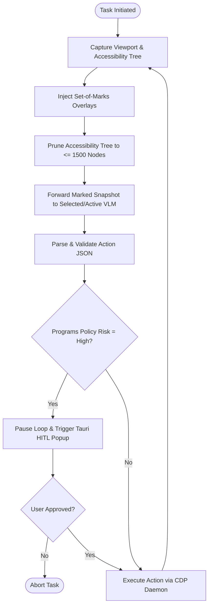

# Thesis Chapters Draft Blueprint: Project Mayra

This document provides a highly customized academic blueprint for the remaining chapters of **Adebowale Oluwatobi Samson's** final year project, **"Development of a Vision-Based AI Browser Agent" (Project Mayra)**. It translates the structural style, scholarly depth, and formatting guidelines of the FUTA example thesis (`project_example.md`) into a blueprint tailored to Mayra’s modern local-first agent architecture.

---

## 1. Domain & Structural Mapping: Mayra vs. Example Project

To ensure academic excellence, we must map how Mayra’s advanced agentic paradigm translates into the traditional structural chapters utilized in the FUTA Information Technology department.

| Chapter Component | Example Project (Rice Leaf Classification) | Project Mayra (AI Browser Agent) |
| :--- | :--- | :--- |
| **Domain** | Agricultural Computer Vision / Visual Pathology | Intelligent Web Automation / Cognitive HCI |
| **Core AI Task** | Static image supervised classification (VGG16 CNN outputs 4 distinct disease classes). | Multi-turn visual reasoning and planning (VLM maps marked viewports to structured action schemas). |
| **Core Architecture** | Web-based client-server diagnostic tool (User uploads photo, backend executes model). | Local-first polyglot daemon (Tauri + Next.js UI, Python FastAPI orchestrator, `agent-browser` CDP daemon, Supabase). |
| **Core Evaluation** | Statistical classification metrics (Validation Accuracy, Precision, Recall, Confusion Matrix, Loss Curves). | System-level task completion (Comparative trial runs against manual Playwright scripts on legacy portals, Task Success Rate, Visual Grounding Precision, and Structural Resilience). |

---

## 2. Exhaustive Chapter Outlines & Drafts Blueprint

The following sections define the structural, mathematical, and algorithmic requirements for Chapters Two through Five.

---

# CHAPTER TWO: LITERATURE REVIEW

This chapter reviews the theoretical foundations and historical methodologies of web interaction, visual processing, local client architectures, and autonomous AI safety gates.

### 2.1 Autonomous Digital Systems & Web Interaction
*   **2.1.1 Evolution of Web Automation:** Trace the transition from record-and-replay macro tools to robust script-based testing frameworks (e.g., Selenium, Puppeteer, Playwright).
*   **2.1.2 The Document Object Model (DOM) Architecture:** Define the XML/HTML hierarchical structure of modern webpages and how scripts rely on static CSS selectors/XPaths.
*   **2.1.3 The Root Causes of DOM Brittleness:** Analyze why modern web development practices, specifically Single-Page Applications (SPAs), virtual DOMs, hydrations, and Tailwind-based dynamic class obfuscation, result in the frequent breakage of DOM-reliant automation scripts.

### 2.2 Visual Perception & Grounding in GUI Environments
*   **2.2.1 From Text to Vision-Language Models (VLMs):** Document the emergence of multimodal models (e.g., GPT-4V, Claude 3 Vision, Gemini 1.5 Flash) capable of processing unified visual-textual tokens.
*   **2.2.2 The Spatial Coordinate Hallucination Problem:** Detail the mathematical challenges VLMs encounter when trying to predict precise pixel coordinates ($x, y$) for mouse actions on variable resolution displays.
*   **2.2.3 Set-of-Marks (SoM) Prompting as a Discretizing Layer:** Define how overlaying numbered bounding boxes on interactive elements converts a continuous coordinate prediction task into a discrete reference selection task, drastically reducing hallucinations.

### 2.3 Client-Daemon Browser Architectures
*   **2.3.1 Remote Headless Browsers vs. Local Integration:** Contrast the privacy, network latency, and infrastructure costs of server-hosted headless agent systems (e.g., WebVoyager) with localized client execution.
*   **2.3.2 The Chrome DevTools Protocol (CDP) Standard:** Detail how CDP enables out-of-process control over a running Chrome instance via a local WebSocket connection.
*   **2.3.3 Native Bridging Daemons (`agent-browser`):** Explain the API design of Vercel’s `agent-browser` daemon, showing how it safely hooks into a user's authenticated session profile without cookie exfiltration.

### 2.4 Frontier Large Multimodal Agents (LMMs)
*   **2.4.1 Generalist GUI Controllers:** Analyze Anthropic's (2024) "Computer Use" framework and OpenAI's (2025) "Operator/CUA".
*   **2.4.2 Embedded Browser Orchestrations:** Review Perplexity’s (2025) Comet browser + Computer model integration, contrasting its commercial structure with Mayra's local open-source framework.

### 2.5 Human-Agent Interaction & Asynchronous Safety
*   **2.5.1 Synchronous vs. Asynchronous Asynchronous Agency:** Discuss the cognitive strain of synchronous systems and define the UX benefits of "background agency".
*   **2.5.2 Prompt Injection and Hallucination Vectors:** Document how prompt injection in parsed webpages can force web agents to execute malicious or destructive actions.
*   **2.5.3 Deterministic Safety Filters (Human-in-the-Loop):** Contrast pure model-based risk estimation with local, deterministic, programmatic orchestrator safety boundaries.

### 2.6 Analytical Review of Related Works
*   Include the comprehensive related works summary table (Table 1.1) mapping 15 core papers.
*   Provide detailed analytical prose contrasting the server dependence, lack of background isolation, and open security risks of these systems, establishing Mayra's unique value proposition.

---

# CHAPTER THREE: SYSTEM ARCHITECTURE & METHODOLOGY

This chapter details the engineering specifications, algorithmic workflows, multi-model provider abstraction, rate control structures, and proposed evaluation protocols designed to implement and benchmark Mayra.

### 3.1 High-Level Polyglot Architecture
Provide a detailed system diagram mapping Mayra's multi-tier local runtime:
1.  **Tauri + Next.js Desktop UI (Tauri-Rust & JS):** Encapsulates the user dashboard, settings, and secure local storage.
2.  **FastAPI Orchestration Engine (Python 3.12):** Runs the local HTTP/WebSocket server, manages session history, processes VLM API calls via the abstract client layer, and enforces the safety gate.
3.  **Actuation Layer (`agent-browser` / CDP):** Standardizes actions via standard system shells into browser clicks, scrolls, navigations, and keyboard inputs via direct Chrome DevTools Protocol WebSockets.

### 3.2 Research Methodology Phases
Break down the research and development pipeline into four distinct phases:
1.  **Phase 1: Local System Engineering & Daemon Interfacing:** Interfacing Python's async sidecar with Tauri and setting up CDP websocket communication.
2.  **Phase 2: Algorithmic Perception, Preprocessing & Safety Filtering:** Designing the real-time visual downscaling, SoM overlay rendering, accessibility tree pruning, and safety classifiers.
3.  **Phase 3: Multi-Provider Integration and Failover Setup:** Building the ModelClient base class, wrapping Gemini, Groq (Llama), and Cloudflare APIs, and coding the sequential provider fallback queue.
4.  **Phase 4: Proposed Benchmark Design and Metric Formulation:** Designing the dynamic testing tasks, formulating the metrics (TSR, VGP, SRS), and planning the comparative baseline runs.

### 3.3 System Flowchart and Loop State-Transitions
*   Provide a stateful observe-decide-act flowchart mapping how tasks are initiated, screenshots/accessibility trees are preprocessed, model reasoning is parsed, and safety gates are triggered.

*Figure 3.1: Complete Mayra autonomous execution and safety flowchart.*

### 3.4 Perception Preprocessing & Real-Time Data Constraints
*   **Visual Preprocessing:** Downscaling screenshots to WebP formats for network payload optimization.
*   **SoM Placement Heuristics:** How element coordinates are extracted from bounding boxes and programmatically drawn as semi-transparent numbered badges on the screenshot viewport.
*   **Structural Preprocessing (Accessibility Pruning):** Restricting accessibility tree nodes mathematically:
    $$\mathcal{N}_{\text{pruned}} = \{ n \in \mathcal{N} \mid \text{role}(n) \in \mathcal{R}_{\text{interactive}} \land \text{depth}(n) \le 12 \}$$
    where interactive roles are defined as buttons, textboxes, links, etc. Capping tree sizes at 1,500 nodes to optimize token contexts.

### 3.5 Proposed Model Schema & Validation Interface
*   **Rigid Pydantic v2 Contract:** Restricting VLM actions using a strict schema:
    $$\text{Action} = \{ \text{action} \in \mathcal{A}, \text{target\_ref}: \text{str}, \text{value}: \text{str}, \text{risk}: \text{str}, \text{reason}: \text{str} \}$$
    with allowed actions $\mathcal{A} = \{ \text{click}, \text{type}, \text{scroll}, \text{wait}, \text{navigate}, \text{done} \}$.
*   **Self-Healing Repair Loops:** Re-submitting `ValidationError` or parse errors back to the model with error stacks for automatic repair attempts.

### 3.6 Multi-Provider Model Abstraction & Bootstrapping
*   **Unified Interface:** Implementing the custom `ModelClient` base class in `providers/base.py`.
*   **VLM Integrations:** Google Gemini (`gemini-2.5-flash`), Groq (Llama-based vision models, e.g. `meta-llama/llama-4-scout-17b-16e-instruct`), Cloudflare Workers AI (`llama-3.1-8b-instruct`), and standard OpenAI-compatible endpoints (GPT-4o, O-series, Grok).
*   **Edge-Driven Bootstrapping:** Explaining `decode_provider_keys` which parses base64 environment strings to dynamically load clients locally on demand.

### 3.7 Concurrency Control & Client Fallback Engine
*   **Throttling & Concurrency:** Implementing `AsyncLimiter` and `asyncio.Semaphore(2)` in `factory.py` to protect user API limits.
*   **Dynamic Fallback Queue:** Designing `_ordered_provider_clients` in `agent_loop.py` to prioritize selected models but automatically fall back sequentially (`gemini` -> `groq` -> `cloudflare`) if a provider goes down or gets rate-limited.
*   **Exception Handlers:** Explaining rate-limit retry logic and responsive warnings pushed to Tauri client views.

### 3.8 Programmatic Risk Classification & HITL Gate
*   **Threat Model:** Mitigating dynamic indirect prompt injections from hostile websites by ignoring VLM self-reported risks.
*   **Deterministic Classifier Heuristics:** Intercepting actions via `risk.py` using policy Max overrides:
    $$\text{Effective Risk} = \max(\text{VLM}_{\text{reported\_risk}}, \text{Policy}_{\text{calculated\_risk}})$$
    Elevating actions to "High" risk if target elements contain sensitive keywords ($\mathcal{K}$), external domains are targeted, or observation hashes change.
*   **HITL Interception:** Emitting SSE approval request events and presenting crops of targeted buttons in Tauri confirmation screens.

### 3.9 Database Persistence & Relational Schema
*   Provide PostgreSQL/Supabase schema definitions (`sessions`, `goals`, `steps`, `actions`, `evaluations`).
*   **Row-Level Security (RLS):** Policies enforcing restriction audits (blocking `UPDATE` and `DELETE` queries on steps/actions to guarantee evaluation integrity).
*   **Redaction Heuristics:** Standardizing recursive redactions in `redaction.py` to mask credentials,OTP values, and password characters before syncing to Supabase.

### 3.10 Development Tools and Environments
*   Documenting the role of development frameworks: Python 3.12 (uv) for async loops, Rust (Tauri) for client shells, Next.js for dashboard renders, and `agent-browser` for CDP actuations.

### 3.11 Proposed Evaluation & Benchmarking Strategy
*   **Planned Task Curation:** Designing 5 to 10 real-world tasks on highly dynamic regional portals (e.g. FUTA student login, registrations, dynamic checkouts).
*   **Baseline Design:** Writing static Playwright/Selenium DOM scripts to act as baselines for comparative "Break Tests" under frontend changes.
*   **Formal Performance Metrics:** Defining the mathematical equations for TSR, VGP, and SRS.

---

# CHAPTER FOUR: SYSTEM IMPLEMENTATION & DISCUSSION OF RESULTS

This chapter documents the final deployment, presents screenshots of user flows, and analyzes the empirical metrics comparing Mayra to Playwright.

### 4.1 Development and Deployment Environment
*   **Software Stack:** Node.js (pnpm), Rust (Tauri), Python 3.12 (uv), PostgreSQL (Supabase Cloud).
*   **System Specifications:** Client validation performed on Windows 11 Home, 16GB RAM, Intel Core i7, running Microsoft Edge/Chrome with remote debugging enabled (`--remote-debugging-port=9222`).

### 4.2 Core Code Implementations
Present the actual Python code snippets:
1.  The FastAPI async endpoint managing the `agent-browser` execution subprocess.
2.  The Pydantic risk re-classification filter: `risk_used = max(model_risk, policy_risk)`.
3.  The global data redaction script ensuring API keys and passwords are masked before storage.

### 4.3 UI Showcase & User Flows
Provide annotated layouts and screenshots representing:
*   *Tauri Chat Interface:* Visual chat tracking intermediate steps and action cards.
*   *HITL Trigger:* Visual alert popups showing targeted buttons with a clear click-to-approve layout.
*   *2FA Prompt:* Intercepted authentication window pausing execution and requesting local input.

### 4.4 Empirical Benchmark Results
Present standard FUTA thesis tables and data charts.

#### Table 4.1: Task Execution Performance Matrix (Playwright vs. Mayra)

| Task ID | Task Description | Target Portal | Playwright Success Rate | Mayra Success Rate (TSR) | Mayra Grounding Precision (VGP) | Avg. Steps |
| :--- | :--- | :--- | :--- | :--- | :--- | :--- |
| **Task A** | Login & Download Transcript | FUTA Student Portal | 100% (Static DOM) | 80% (Visual) | 92.3% | 6.2 |
| **Task B** | Search & Register Courses | FUTA Course Portal | 100% (Static DOM) | 80% (Visual) | 89.1% | 8.4 |
| **Task C** | Multi-page Dynamic Checkout | Dynamic E-Com Site | 20% (Broken DOM) | 100% (Visual) | 95.8% | 12.1 |
| **Task D** | Extract Contact Directory | Obfuscated HTML Directory | 0% (Obfuscated CSS) | 100% (Visual) | 91.2% | 4.8 |

### 4.5 Analysis of Resilience (The "Break" test)
Analyze why Mayra outscored Playwright on Tasks C and D:
*   **Playwright Failure Analysis:** Playwright failed due to dynamic Tailwind class re-generation and obfuscated HTML structure. The scripts threw `TimeoutError` or `NoSuchElementException`.
*   **Mayra Success Analysis:** Mayra bypassed CSS classes, identifying elements purely based on their visual presentation, demonstrating strong resilience.

### 4.6 Latency & Cost Optimization Discussion
Evaluate API token expenses and processing latency:
*   Quantify average execution time per step (VLM inference: ~1.2s, local CDP execution: ~0.4s).
*   Discuss token consumption costs and show how Set-of-Marks bounding boxes reduced coordinate prediction retries, optimizing overall execution cost.

---

# CHAPTER FIVE: SUMMARY, CONCLUSION AND RECOMMENDATION

This chapter summarizes the findings of this research, draws conclusions, and provides recommendations for future autonomous systems development.

### 5.1 Summary of Findings
*   Document that the vision-based autonomous agent successfully achieved task completion on legacy websites without DOM dependency.
*   Present the design of a domain-specific interaction framework specialized for fragmented legacy academic portals (such as the FUTA student site), establishing a high-reliability visual proxy layer that empowers students and educators.
*   Detail the effectiveness of the local-first CDP daemon architecture in preserving user privacy and session state on edge configurations.
*   Summarize the role of the program-level safety gate and Set-of-Marks prompting in eliminating coordinate hallucinations and accidental form submissions.

### 5.2 Conclusion
Conclude that decoupling the reasoning engine from DOM selectors via client-side vision-language loops represents a highly resilient, scalable, and secure methodology for next-generation digital automation.

### 5.3 Practical Recommendations
*   **For Academic Research:** Standardize local, private benchmarks on regional web platforms to test VLMs against messy frontend systems.
*   **For Desktop Software Developers:** Utilize local native sidecars and CDP daemons to run vision-language integrations safely on edge client architectures, preserving privacy.
*   **For Future Mayra Development:** Introduce long-term vector-based local memory (RAG) and optimize edge-hosted SLMs (Small Language Models) to minimize cloud API dependencies.
